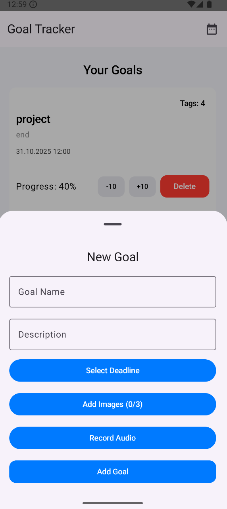
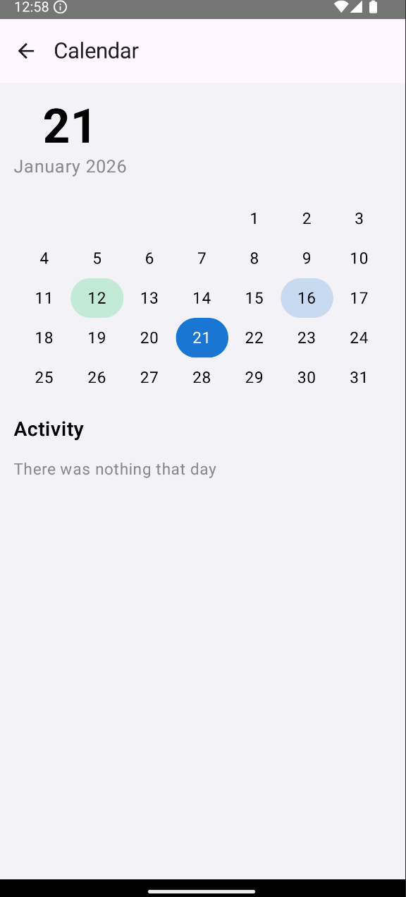

# Goal Tracker (Android, Jetpack Compose)

Open-source Android goal tracker built with **Jetpack Compose**, **Room**, and **Material 3**.

The app focuses on simple goal tracking with deadlines, progress, and calendar-based activity visualization.

---

## ✨ Features

- Create goals with description and deadline
- Progress tracking (+ / -)
- Calendar view with daily activity
- Tags for goals
- Audio notes per goal
- Images attached to goals
- Fully offline (Room database)
- Modern UI using Jetpack Compose

---

## 📸 Screenshots

  
  
  
  

---

## 🛠 Tech Stack

- Kotlin
- Jetpack Compose
- Room
- Material 3
- Coroutines / Flow
- MVVM

---

## 🚀 How to run

1. Clone the repository
git clone https://github.com/romax2x/treker-app.git
2.Open in Android Studio
3.Sync Gradle
4.Run on emulator or real device

---

## 🧭 Roadmap

- [x] Goal creation
- [x] Progress tracking
- [x] Calendar view
- [x] Tags & media
- [ ] UI polishing
- [ ] Notifications
- [ ] Statistics screen
- [ ] Cloud sync (optional)

---

## 💬 Feedback

Feedback, suggestions, and bug reports are very welcome.

Please use:
- **GitHub Issues** for bugs or ideas
- **Pull Requests** for improvements

---

